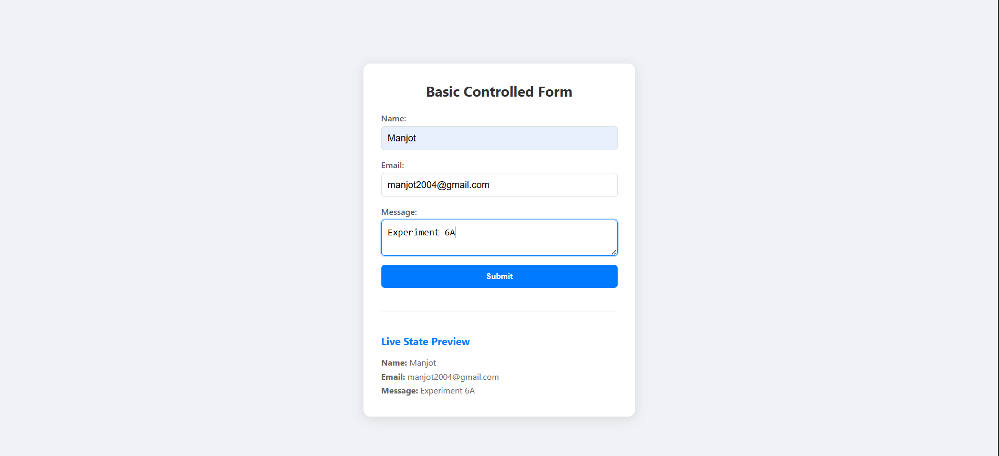
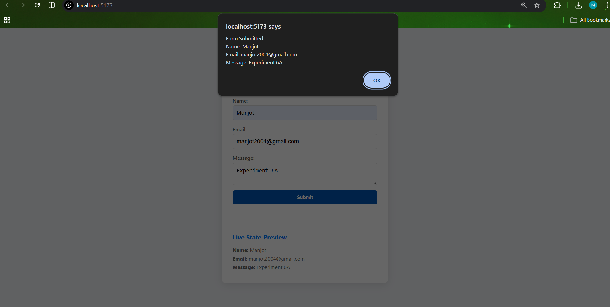

# Simple Controlled Form (Part 1)

This project demonstrates the core concept of **Controlled Components** in React. In a controlled component, form data is handled by a React component's state rather than the DOM.

## 🚀 Aim
To create and handle a basic form in a frontend application using React's `useState` hook, ensuring that the state is the "single source of truth" for the input values.

## 🧪 Theory: Controlled Components
In HTML, form elements like `<input>`, `<textarea>`, and `<select>` typically maintain their own state and update it based on user input. In React, mutable state is typically kept in the state property of components. 

A component that controls the input elements by setting their values from the state and updating the state on every change is called a **Controlled Component**. This provides:
- **Immediate access** to form data.
- **Easy manipulation** of input values (e.g., forcing uppercase).
- **Synchronized UI** elements (like live previews).

## 🛠️ Implementation Details
- **State Management**: Uses the `useState` hook with an object structure to keep track of multiple fields (`username`, `email`, `message`).
- **Dynamic Updates**: Uses a generic `handleChange` function that utilizes the `name` attribute of the event target to update the corresponding state key.
- **No Validation**: This is a baseline implementation focused purely on the data flow between the UI and React state.

## 📁 Key Files
- `src/SimpleForm.jsx`: The main form component containing the `useState` and `handleSubmit` logic.
- `src/App.jsx`: The layout wrapper for centering the form.
- `src/App.css`: Professional, clean styling for a focused user experience.

## 📝 Procedural Steps
1. **Initialize State**: Create a state object with keys matching your input names.
2. **Bind Values**: Set the `value` attribute of inputs to their corresponding state value.
3. **Handle Change**: Use an `onChange` handler to call `setFormData` whenever a user types.
4. **Prevent Default**: In `handleSubmit`, use `event.preventDefault()` to stop the browser from refreshing the page.

## 💻 How to Run
```bash
# Install dependencies
npm install

# Start development server
npm run dev
```
## Screenshots

