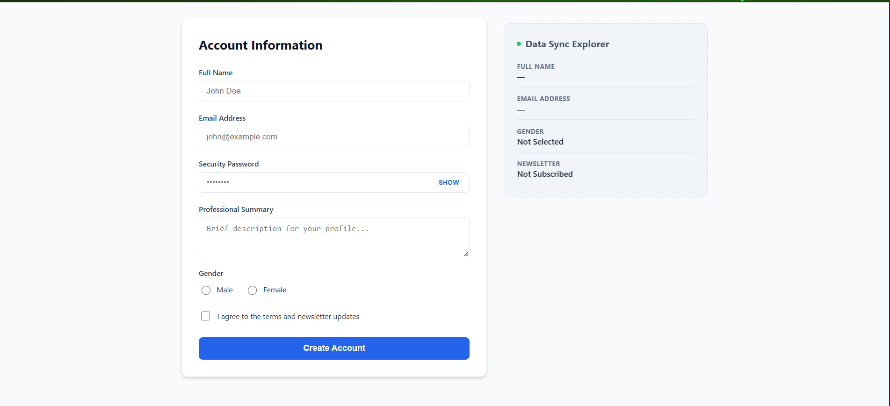
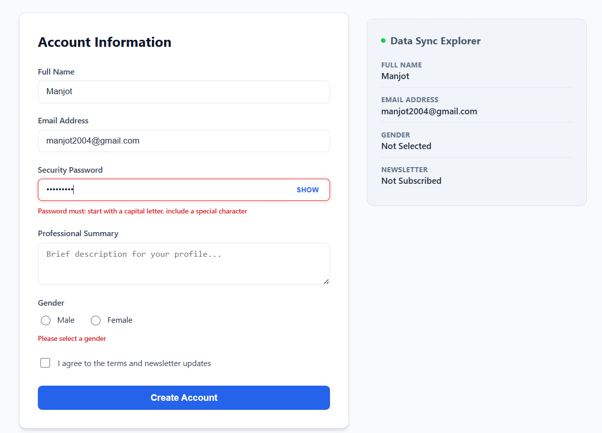
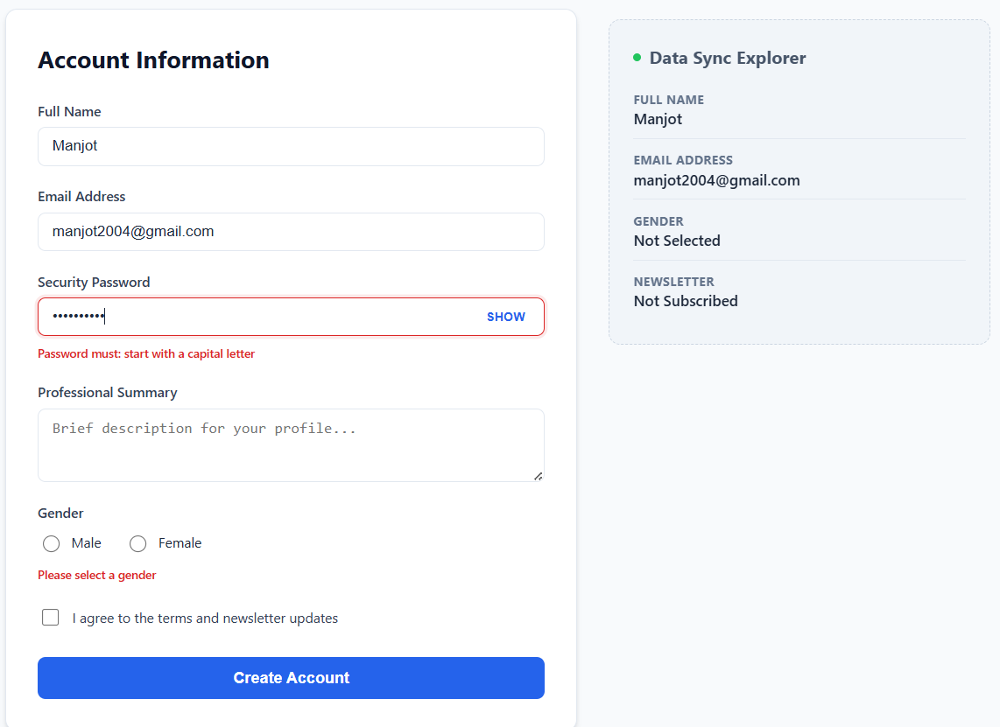
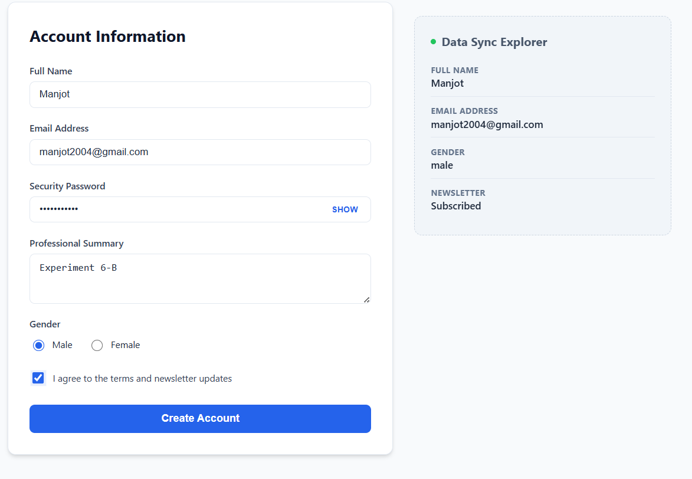
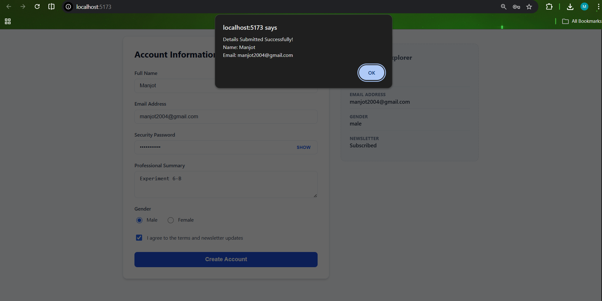

# Controlled Form with Custom Validation (Part 2)

This project extends the controlled form concept by adding **robust custom validation logic** and a **professional SaaS-inspired UI/UX**. It demonstrates how to handle complex user requirements in a real-world React application.

## 🚀 Aim
To implement a high-fidelity form with specific security and formatting validation rules for Email and Password fields, providing real-time visual feedback to the user.

## 🧠 Theory: Validation in Controlled Components
Validation in controlled components happens by checking the current state values against specific criteria (usually via Regex) before allowing form submission. By storing an `errors` object in the component state, we can:
- **Block Submission**: Prevent form submission if the `errors` object is not empty.
- **Conditional Styling**: Dynamically apply CSS classes (like `error-input`) based on the presence of an error.
- **Micro-copy Feedback**: Display specific helpful messages to guide the user towards success.

## 🛡️ Detailed Validation Logic
- **Email format check**: Verified against a Regex pattern: `/^[^\s@]+@[^\s@]+\.(com|in|[a-z]{2,})$/i`.
- **Password Strength**:
    - **Starts with Uppercase**: `^[A-Z]` regex check.
    - **Numeric Inclusion**: At least one `\d`.
    - **Special Characters**: Checks for symbols like `!@#$%^&*`.
    - **Minimum Length**: string `.length` check for a minimum of 5.
- **Selection Safety**: Logic to ensure `gender` is explicitly chosen (no default/accidental selection).

## ✨ Key Technical Features
- **Security UX**: A toggleable password field (`type="text"` vs `type="password"`) for improved accessibility.
- **Data Sync Explorer**: A sidebar that demonstrates React's "re-render on state change" capability by showing a live, formatted view of the current form data.
- **Error Persistance**: Errors are cleared selectively as the user starts correcting the specific field, improving the "Flow" of the user experience.

## 📁 Project Architecture
- `src/ControlledForm.jsx`: The "Smart Component" containing all logical predicates and state handlers.
- `src/App.css`: A comprehensive design system using CSS variables, Flexbox/Grid, and transitions.

## 📝 Procedural Steps
1. **Define Validation Schema**: Create helper functions for Email and Password logic.
2. **State Setup**: Initialize `formData` for values and `errors` for feedback.
3. **Handle Change & Clear**: Update values and clear specific error keys on input.
4. **Final Check**: On submit, run all validation functions and populate the `errors` state if any check fails.
5. **Render Feedback**: Use logical AND (`&&`) operators to show error text in the JSX.

## 💻 How to Run
```bash
# Install dependencies
npm install

# Start development server
npm run dev
```
## Screenshots




