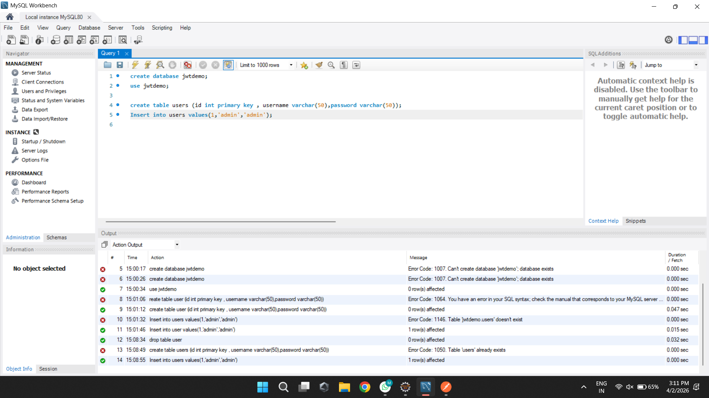
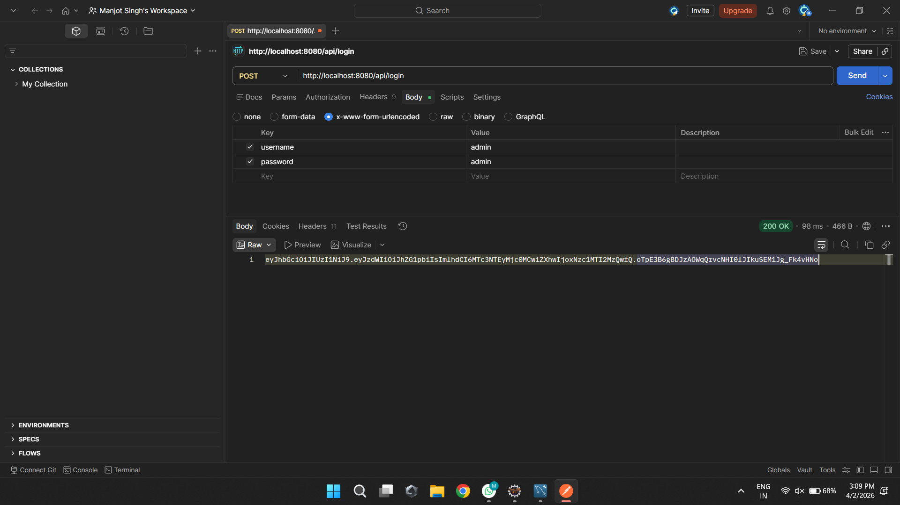
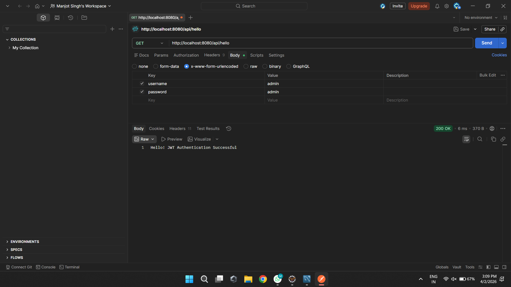

# Experiment 9: Implementing JWT Authentication and Security in Spring Boot

This repository demonstrates the implementation of **JSON Web Token (JWT)** based authentication and authorization using **Spring Security**. The application ensures secure access to REST endpoints by validating signed tokens and interacting with a **MySQL** database for user credential verification.

---

## 🎯 Objectives
- To understand the architecture of **JWT (JSON Web Token)**.
- To configure **Spring Security** for stateless authentication.
- To implement a login system that generates a secure JWT upon successful credential validation.
- To secure specific API endpoints and validate tokens in incoming requests.
- To integrate **Spring Data JPA** with MySQL for persistent user storage.

---

## 🛠️ Tech Stack & Tools Used
- **Language / Framework:** Java, Spring Boot
- **Security:** Spring Security, io.jsonwebtoken (jjwt)
- **Database:** MySQL Server
- **API Testing tool:** Postman
- **Build Tool:** Maven

---

## 🗂️ Step-by-Step Implementation & Execution Sequence

Below is a detailed walkthrough of the implementation structure mapped with terminal logs and expected outputs:

### 1. Database Setup & User Schema in MySQL
The application uses a database named `jwtdemo`. A `users` table is maintained to store user credentials (username and password). This acts as the source of truth for the authentication process.

*Figure 1: Viewing the `jwtdemo` database and user records in MySQL Workbench.*

---

### 2. Security & JWT Implementation
The codebase includes:
- **`JwtUtil`**: Handles token generation, signing (using HS256), and extraction of claims.
- **`SecurityConfig`**: Configures the security filter chain, password encoding, and CSRF settings.
- **`AuthService`**: Validates credentials against the database and triggers token generation.

---

### 3. API Testing: User Login & JWT Generation
We test the authentication flow using Postman. By sending a **POST** request to `/api/login` with valid credentials (`username` and `password`), the server returns a signed JWT.

*Figure 2: Successful authentication via Postman, returning a unique JWT for the user.*

---

### 4. API Testing: Accessing Protected Resources
Once the token is obtained, it can be used to access protected endpoints. A **GET** request to `/api/hello` verifies that the authentication was successful and the user is authorized to view the resource.

*Figure 3: Accessing a protected endpoint successfully after JWT validation.*

---

## 💡 Key Learnings
- **Stateless Authentication:** Understanding why JWT is preferred for RESTful services over session-based auth.
- **Spring Security Filters:** Learning how to customize security chains and permit/restrict access.
- **Token Lifecycle:** Managing token generation, signing keys, and expiration.
- **Integration:** Seamlessly connecting Spring Security with JPA-based user repositories.

---
